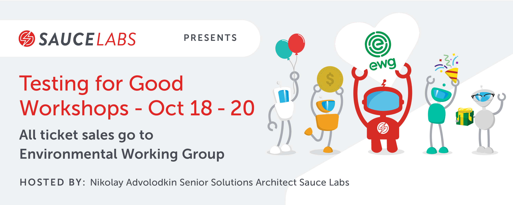

# testing-for-good-oct-2022
Pre-requisites for all of the TFG workshops

## [Mobile Testing with Java pre-reqs](https://github.com/eyaly/mobile-appium-java-workshop#setup)

## [API Testing with Java pre-reqs](https://mail-attachment.googleusercontent.com/attachment/u/0/?ui=2&ik=d165b816d4&attid=0.1&permmsgid=msg-f:1741391466190672969&th=182aaa4fed311449&view=att&disp=inline&saddbat=ANGjdJ-o2VdKlCpWwWWMhWio8FFbKwfhKjxkzr6vqzeXOsAxFf6JvydwS4Q4iQ9mESgyWWkfy-ZzKVYWQsowmFKp1ENQaMyUP7PH73gJtilmAM2zLXo7xNFPqZOVLGCEfCgIzzA-oNg81bXMRVyBiV6wgjxjpn8iSxsyIBa9kU6K5rKx_yW-zZF1DefuUKdrDofGnfy_jWEUiBnfik2kZaIhmsskWGQwx6-9dm8axgjkLWCEfYOKcwDw62CjjTl4xOjl-sX9ojAqcuV8taOol2TohqC2PQKmNmgR-IMAggf3qU4WOP9McyyJIfjEuj_VjdV34V2mnODlMuQjIh6Bd2qhNnxLdT_cauWiY2aoJY9XFsAltliSsV77ZWb3Om9_f5nCNGu46sap2qfPX3rOgyNkezyLFD7HaCY3ZeJENMUcLXpjc66VRgcW4tooxK77PrvX2XfH73yiFAqSN5IKEvC8_FnHLbJ_odlKX0qprOQ1_jLUAucq2Yc6VQa2iUXPZdVn5ZqXWGo0oL2fE_fkr1Ek7lDAAZ-lxSqs8IB8T6qB9QXB-89PpiBJqGVuwocKhlG2LkDJEzOFOFwNhAHxDQHZoZgoIQwyvLILs7btiVoxB66nMYTFWDpGC2u-H4vHdPmPbAtLQWk1og0H5jqf5ikdgjxs9J4jbr64VhRLcVQjhuT6XpovorErbmKNZvOPRnYZ2KPAkmMd7M0w8kARVcdyekWjiOpNKr8EwGhJRgOoXHWJJ_P66syxMiLhFbBVdaaeclUtEDhcOHKQ1fUWXufRQlz_zS6NzwW0pNfjuI6RCVpmMBK6FZPDVzM5w3TAtAlo2Cf_GM1393g8YbeU)

## [Web testing with JavaScript pre-reqs](https://github.com/nadvolod/js-code/tree/master/web-testing-2022)

## [API testing with JavaScript pre-reqs](https://github.com/nadvolod/js-code/tree/master/api-testing-2022)

## Crafting a Testing Framework pre-reqs

- Experience with Java
- Git Installed
- IntelliJ installed
- JDK v1.8 or higher installed

## End to End & Component Testing using Cypress

- Coming later

### 🌎Testing for Good enables great test automation engineering while shaping a more equitable society.👩‍💻

Today, we're asking for donations for [Environmental Working Group](https://buy.stripe.com/9AQdU42lj9i7bHGcMN)

### [About Environmental Working Group](https://www.ewg.org/)

We're advocates who won't quit. We're scientists that find solutions. We're people trying to make the safest choices for our health. At the Environmental Working Group, we believe that you should have easy access to the information you need to make smart, healthy choices. It’s this belief that inspired our president and co-founder, Ken Cook, to create EWG.  

Since 1993, we've worked tirelessly to protect public health. Whether it's spotlighting harmful industry standards, speaking out against outdated government legislation or empowering consumers with breakthrough education and research, we're in this fight. 

And we're not going anywhere.

👉 While the event is free, Sauce Labs encourages all attendees to 

👉 **[donate](https://buy.stripe.com/9AQdU42lj9i7bHGcMN)** 

Anything helps! 

100% of donations go to support the cause.
